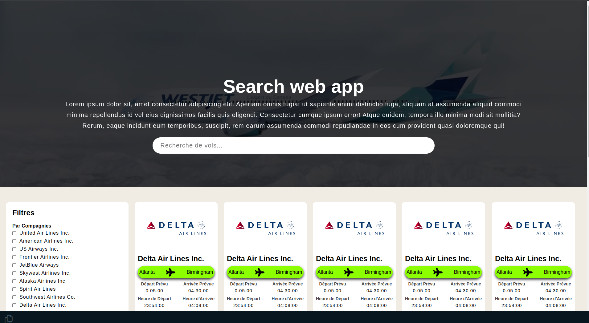
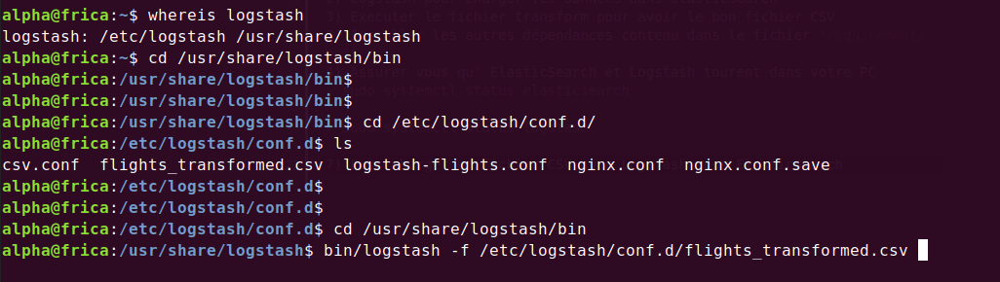

# **MIS EN PLACE D'UN MOTEUR DE RECHERCHE AVEC ELASTICSEARCH**

**Page principale**

### **Dépendances**
1) Java (JDK)
1) ElasticSearch
2) Logstash pour charger les données dans ElasticSearch
3) Executer le fichier transform pour avoir le bon fichier CSV
3) Installer les autres dépendances contenu dans le fichier *requirements.txt*
4) Assurer vous qu' ElasticSearch et Logstash tourent dans votre PC
> sudo systemctl status elasticsearch

> sudo systemctl status logstash

7) Pour charger un fichier CSV avec Logstash sous ElasticSearch

8) Puis vous pouvez lancer le projet 

> python app.py